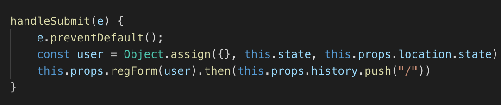

# DICEBOX
Dicebox is media player focused on streaming tabletop content. It serves as a resource for players looking to share their games and as a general soruce of entertainment for viewers. 
Dicebox uses Rails as a backend and React/Redux as a frontend. Video content is hosted on and accessed through AWS.

# Link
https://dicebox.herokuapp.com/#/

# Auth
The user can currently navigate the website in its entirety without requiring an account. An account will still be required for interacting with any content outside of viewing (i.e. likes, comments, uploads).

The account creation prompts the user for a username, email and password. On login, the user is required to input a verfied email. With a verified email, the user will be brought to a second screen to input their password.

# Videos
Videos are hosted through AWS. The homepage displays a selection of videos. On click, a user will be brought to the play page for the selected video.

# Features to be added
* Search functionality
* User comments
* User uploads
* User channel
* Sidebar with suggessted videos
* Video likes, views, post date
* Louder errors in certain pages
* Red box for errors on login

# Extra Potential Features
* Possbile Dice Roller
* 5th Edition DnD character creator
* Character/Video integration for interactive content
